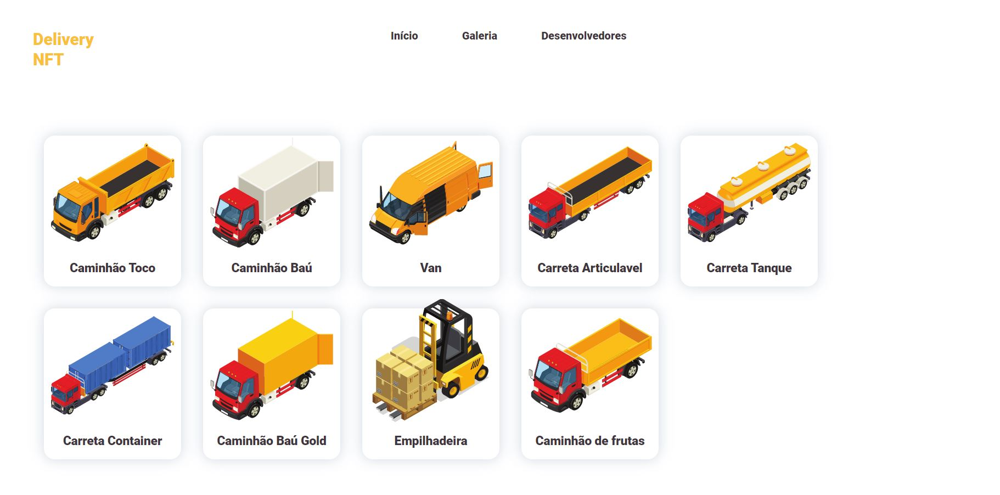
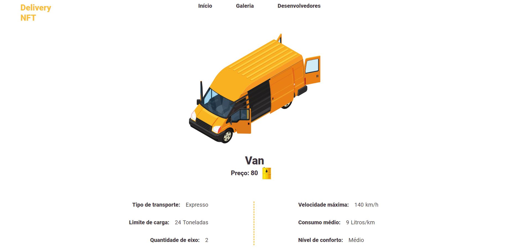
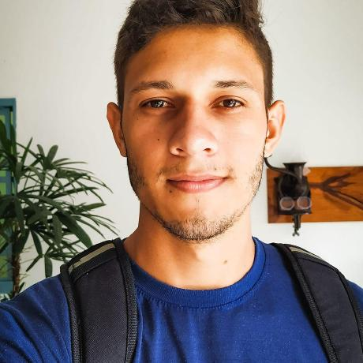

<h1 align="center">Nft Trucks</h1>

Tabela de conteúdos
=================
<!--ts-->
   * [Sobre](#sobre)
   * [Estudo](#estudo)
   * [Pre Requisitos](#pré-requisitos)
   * [Autores](#autores)
<!--te-->

### Sobre
Nft Trucks é um site de galeria que apresenta veículos que são NFTs fictícias.
O objetivo desse trabalho é aprender sobre desenvolvimento usando DJango.
Esse é um trabalho para matéria de Linguagens de Programação para Web. Realizado no ano de 2021.

Galeria

 

Pagina do NFT

### Estudo

No projeto será estudado:
- Desenvolvimento de sites com DJango

### Pré-requisitos

Antes de começar, você vai precisar ter instalado em sua máquina as seguintes ferramentas: 
- [Git](https://git-scm.com) 
- [VSCode](https://code.visualstudio.com/)
- [Python 3.7.0](https://www.python.org/ftp/python/3.7.0/python-3.7.0-amd64.exe)

Instalar o django:
``pip install django``

Criar a estrutura do projeto:
``django-admin startproject projeto .``

Inicializa o servidor:
``python manage.py runserver``

Cria um novo app:
``python manage.py startapp <app>``

<h2 align="center">Autores<h3/>

<table align="center">
  <tr>
    <td align="center"><a href="https://github.com/jefersoncmn"> <b>Jeferson Carlos Martin</b></a> 
    </td>
    <td align="center"><a href="https://github.com/rafaelomodei"> <b>Rafael Omodei</b></a> 
    </td>
</table>
	
<h2 align="center">Contatos<h3/>	
 	
Rafael Omodei

  
  
  

 
Jeferson Carlos Martin
	

